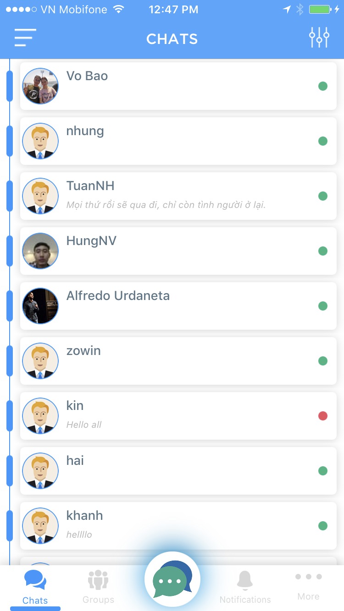
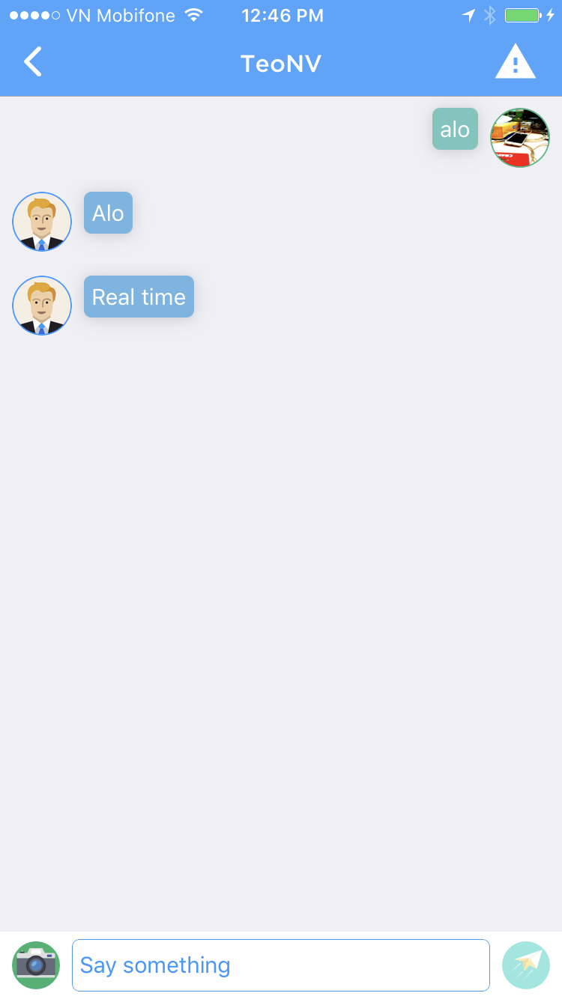

# HuCaChat

> HuCaChat is the messaging app, find friend, entertain with music and watch the latest movie trailers being released,...

## HuCaChat has special points:
* The speed of sending messages is very fast, and you always receive new messages even when you do not open the app.
* Entertainment by listening to music and singing karaoke by lyric.
* Connect with the people around you.
* Integrated login with social networking (Facebook, Twiter).

## Release History
* 1.0
    * Work in progress

## Meta

Open source.

## Contributing

Fork it IDE Academy.
